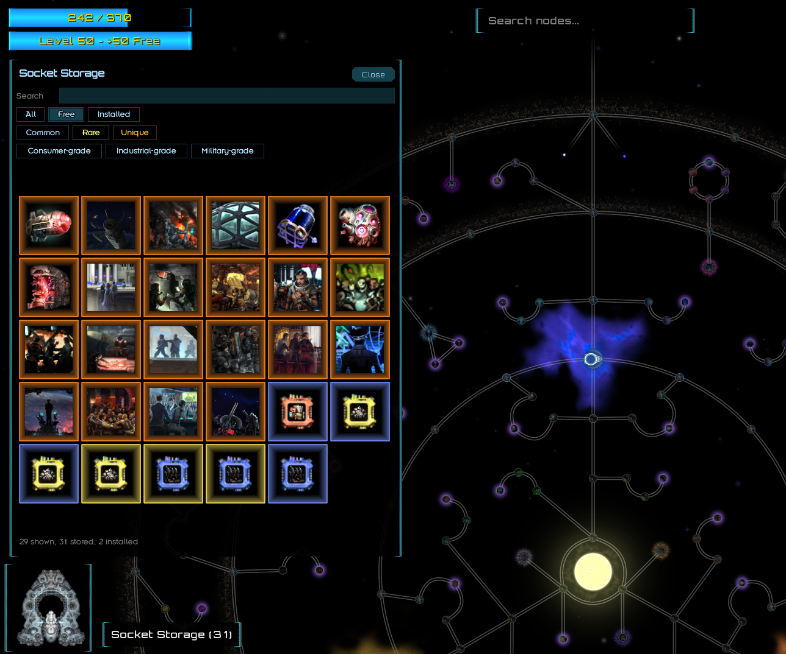
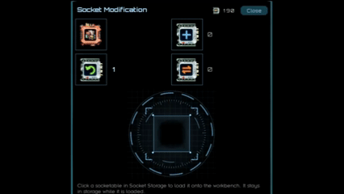
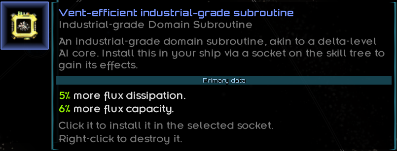
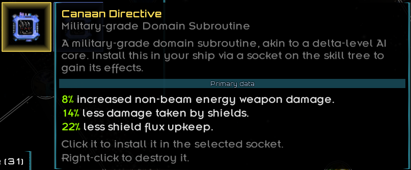
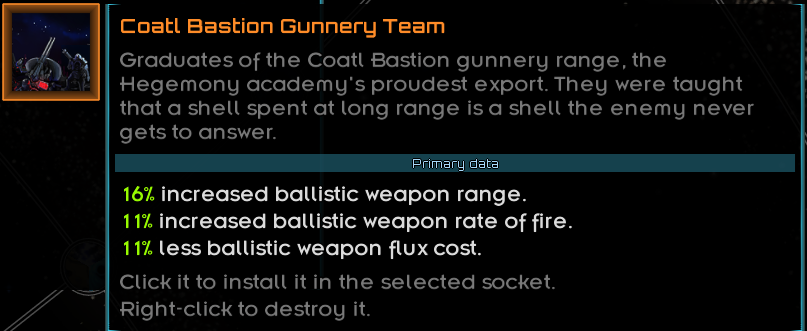
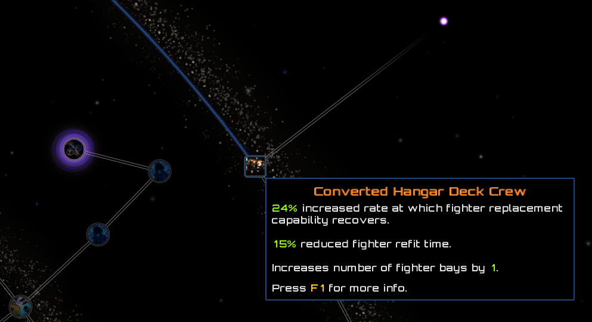

<h1 align="center">Exiled Sector</h1>

<p align="center"><i>Still sane, exile?</i></p>

Designed to be an overhaul of the simple hullmod system based on the infamous Path of Exile skill tree, Exiled Sector is a Starsector mod that gives every ship in your fleet its own skill tree.

<p align="center">
<a href="https://trilink.wispborne.com/open.html?mod=%7B%22url%22%3A%22https%3A%2F%2Fraw.githubusercontent.com%2FExiledPortals%2FExiledSector%2Fmain%2FExiledSector.version%22%2C%22id%22%3A%22exiledSector%22%2C%22version%22%3A%220.1.0%22%7D&dep=%7B%22url%22%3A%22https%3A%2F%2Fraw.githubusercontent.com%2FLazyWizard%2Flazylib%2Fmaster%2Fmod%2Flazylib.version%22%2C%22id%22%3A%22lw_lazylib%22%2C%22version%22%3A%223.0.0%22%7D&dep=%7B%22url%22%3A%22https%3A%2F%2Fraw.githubusercontent.com%2FMagicLibStarsector%2FMagicLib%2Fmaster%2Fmagiclib.version%22%2C%22id%22%3A%22MagicLib%22%2C%22version%22%3A%221.5.6%22%7D&dep=%7B%22url%22%3A%22https%3A%2F%2Fraw.githubusercontent.com%2FLukas22041%2FLunaLib%2Fmain%2FLunaLib.version%22%2C%22id%22%3A%22lunalib%22%2C%22version%22%3A%222.0.5%22%7D"></a>
</p>

<p align="center"><b><a href="https://github.com/ExiledPortals/ExiledSector/releases/latest/download/ExiledSector.zip">Manual download</a></b> | <a href="https://github.com/ExiledPortals/ExiledSector">Source (GitHub)</a></p>

## Features

Open the refit screen and click the skill tree button on any of your ships. There's a whole new sector in there:


- Every ship gets its own tree, with over 300 nodes.
- Some nodes are travel nodes that let you choose between several options.


- Nodes start out costing OP: 1 for frigates, 2 for destroyers, 3 for cruisers and 4 for capitals. Ships also earn XP in combat and level up, and every level lets you take a node for free. Veteran ships get their ordnance points back. The crew gets nothing, as is tradition.
- Some nodes are hidden until you unlock them.


- Plenty of nodes have effects you won't find anywhere in vanilla.
- Beams can split between targets, so your Tachyon Lance can finally disappoint several enemies at once.


- Each faction has its own corner of the tree with thematic nodes. For example, your ship's main goal can be to blow up, and act like it don't know nobody.


- Some nodes are Modular Hull Sockets: perfectly good empty rooms that your engineers swear were always part of the design. Allocate one like any other node, then shove a socketable into it. Socketables turn up at salvage sites, in Tech Mining finds, and aboard NPC flagships whose captains will not be needing them after you're done.
- Ctrl+click a socket to open Socket Storage, a hoard of every socketable you own, lovingly organised by people who will never be allowed to use any of them. Filter by rarity, search by name, and pick what goes in. Right-click one you don't want to disassemble it into Socketable Parts: 1 for a common, 2 for a rare and 10 for a unique, because priceless relics and talented people are, it turns out, mostly screws.
- Socket Storage's Modify button opens the Socket Modification workbench beside it, and the skill tree is locked while it's open so nobody gets distracted mid-surgery. Spend Socketable Parts there to synthesise a new common subroutine or kernels which allow specific kinds of modification. Click an item in storage to load it onto the workbench, left-click a kernel to use it, and right-click a kernel or the new subroutine to synthesise one. 
- Parts and kernels also turn up wherever socketables do. Winning a battle pays out parts too, scaled by the enemy deployment points you destroy or disable and by the battle difficulty bonus. Nothing says "salvage rights" like a smoking hull. If your hold is groaning, a LunaLib setting (off by default) has Socket Storage swallow every part and kernel in your cargo whenever you open it, where they weigh nothing and the workbench can still reach them.




- Common socketables are Domain Subroutines in four grades, each rolling one prefix and one suffix.
- Rare ones roll three or four mods and get a name of their own.




- Unique socketables can be officers, crews and Domain relics with unique effects. They only start turning up once you reach level 15.




## Requirements

- Starsector 0.98a-RC8
- [LazyLib](https://fractalsoftworks.com/forum/index.php?topic=5444.0)
- [MagicLib](https://fractalsoftworks.com/forum/index.php?topic=25868.0)
- [LunaLib](https://fractalsoftworks.com/forum/index.php?topic=25658.0)

Optional:

- Console Commands adds `ExiledSectorGrantFleetXp [amount]`.
- A healthy disregard for vanilla balance.

## Compatibility

> [!WARNING]
> Exiled Sector adds permanent hull mods to the ships in your fleet. It is not safe to remove after being used.

It should be safe to add to an existing save.

Nodes that copy a vanilla hull mod also place the real hull mod on the ship as a phantom: it costs no OP and does nothing itself, but other mods that check for that hull mod see it. That should make most mods work with the tree's nodes without needing dedicated support.

These mods have dedicated compatibility. The version listed is the one I last tested against. Newer versions usually work; if one doesn't, `starsector.log` says so at startup and lists anything Exiled Sector can no longer find.

| Mod | Tested version | What Exiled Sector does with it |
|---|---|---|
| [Second-in-Command](https://fractalsoftworks.com/forum/index.php?topic=30407.0) | 2.0.0 | Its skills see the hull mods your nodes stand in for, and Reconfiguration waives the Converted Hangar penalties. |
| Lost Sector | 0.6.2d, 1.0.b | The Kesteven and Frozen Heart areas of the tree appear, and Augmented Systems hulls get the same bonuses from those nodes as from the hull mods. |
| [MagicLib](https://fractalsoftworks.com/forum/index.php?topic=25868.0) | 1.5.6 | Required. A hull mod that tries to strip one of your nodes' hull mods through MagicLib is removed instead. |
| Random Assortment of Things | 3.3.1 | Modular Hull Socket items can drop from its abyssal structures, abyssal drones and relic sites. |
| Industrial Evolution | 4.1.b | Modular Hull Socket items can drop from its orbital laboratories and arsenal stations. |
| Knights of Ludd | 1.4.0 | Modular Hull Socket items can drop from its research stations and caches. |
| Secrets of the Frontier | 0.15.1 | Modular Hull Socket items can drop from its A Promise station and Hypnos laboratory. |
| Arthr's Ships n Shit | 0.100-dev | Modular Hull Socket items can drop from its Exodyne research stations. |
| What We Left Behind | 4.5.3 | Modular Hull Socket items can drop from its research stations, Omega derelicts and corrupted caches. |
| Ship Mastery System | 2.0.8 | Modular Hull Socket items can drop from its concealed stations, nucleus stations and concealed probes. |
| Unthemed Weapons Collection | 0.7.4 | Modular Hull Socket items can drop from its weapon caches. |
| DIY Planets | 1.0.30 | Modular Hull Socket items can drop from its Genesis terraforming stations. |

Some weapons from other mods misbehave (often hilariously) when their beams are split, their shots are chained or their shells pierce. These are listed in:

- `data/config/exiledSector/split_beam_effect_blocklist.csv`
- `data/config/exiledSector/energy_chain_blocklist.csv`
- `data/config/exiledSector/ballistic_pierce_blocklist.csv`

All three files are merged across mods, so other mods can opt their own weapons out (or you can opt them back in, at your own risk).

## FAQ

<details>
<summary><b>How do I earn and spend points?</b></summary>

Open a ship's refit screen and click the **Skill Tree** button under the hull mods, or press **K**. If you prefer the old LunaLib Additional Options entry, switch the button off in LunaLib settings.

The first time you open a ship's tree you choose where it starts: Low Tech, Midline or High Tech. The starting node is free. Whenever it is the only node allocated, you can click it again to choose a different start. The other two can still be reached later like any other node.

Every node costs the ship's unused ordnance points: 1 for frigates, 2 for destroyers, 3 for cruisers and 4 for capitals. A node can only be allocated next to one you already have. Node tooltips show only what a node does. Press **F1** while hovering one to also see its restrictions, such as the hull mods and nodes it is mutually exclusive with.

After every engagement, each ship in your fleet gains XP equal to the deployment points of the enemy ships destroyed or disabled, whether it deployed or not. Harder fights pay more: the same battle difficulty bonus vanilla shows before combat ("Additional XP due to overall battle difficulty") multiplies it, up to 6×. Easier fights never reduce it. You get half as much if you lose.

Each level makes your most recently bought node free and refunds its OP. If every node you have is already free, the level is banked, and your next node costs nothing. The first level takes 60 XP, each level after that takes 13% more until level 25, and ships cap at level 50.

Ships that join your fleet late don't start from scratch. No ship in your fleet sits below your own character level, so a ship bought at level 12 starts at level 12 and keeps pace as you level up. Ships behind your highest-level ship also earn 10% more XP for every level they trail it, up to 4×, so they catch up over time. Both can be changed in LunaLib settings.

Click an allocated node to remove it. OP-paid nodes refund their OP, and free nodes return their free allocation. You can't remove a node that other nodes depend on to connect back to your starting point, and you can't remove the starting point itself.

Ctrl+Shift+click an allocated node to remove it along with every node that depends on it, starting with the farthest. Doing this on your starting point clears the whole tree and lets you choose a new start. For now it does nothing if any of those nodes has its own removal condition (currently any node that adds fighter bays).

For multi-choice nodes, click to open a dropdown so you can pick an option. Ctrl+click repeats your last choice.

Each ship can have a max of 60 nodes.

Every number in this section can be changed in LunaLib settings.

</details>

<details>
<summary><b>What's the difference between "increases" and "more"?</b></summary>

They're two different kinds of modifier, and they stack very differently. If you've played Path of Exile, it's a similar convention.

Starsector calculates a stat like this:

```java
modified = base + base * percentMod / 100 + flatMod;
modified *= mult;
```

| Tooltip wording | Kind | How it stacks |
|---|---|---|
| "10% **increased** / **reduced** flux capacity" | Percent | All percent bonuses on a stat are **added together** first, including those from vanilla hullmods and skills. |
| "**Increases** flux capacity by 600" | Flat | Added after percent bonuses, so percent bonuses don't scale it. This is different to Path of Exile. |
| "10% **more** / **less** flux capacity" | Multiplier | Applied last, to the total. The tree's multipliers are **added together** first (10% more + 10% more = 20% more; 15% more + 30% less = 15% less), and never go past 100% less. They still multiply with multipliers from vanilla hullmods and skills. |

For example, with a base of 1000 flux capacity:

- Two "10% increased flux capacity" nodes give 1000 × (1 + 0.10 + 0.10) = **1200**.
- Two "10% more flux capacity" nodes give 1000 × (1 + 0.10 + 0.10) = **1200**, applied after everything else.
- "15% increased", "Increases by 600", a +10% hullmod and "20% more" together give (1000 + 250 + 600) × 1.2 = **2220**.

Numbers are green when they help your ship and orange when they hurt it.

</details>

<details>
<summary><b>How do NPC fleets get skill trees?</b></summary>

Every fleet can have trees, in every faction, including your own faction's fleets and your allies. Stations don't get them.

Ships with officers and the flagship always get a tree. Each other ship has a 30% chance. Civilian and mothballed ships are left out. The roll is fixed per ship, so reloading a save won't reroll it.

The number of nodes depends on your character level when the fleet is first spawned:

| Your level | Nodes |
|---|---|
| 1 | 1–2 |
| 5 | 11–13 |
| 10 | 13–28 |
| 15+ | 16–42 |

Every NPC captain reads their ship's specs and makes a plan. The plan is usually sensible and occasionally baffling.

They start from the root that matches their hull's design type (Low Tech, Midline or High Tech), or from wherever their academy, priest or AI author happened to teach. Their first job is replacing refit hullmods the tree offers a node for. The OP that frees up buys extra nodes, but if the node is out of reach they keep the hullmod. Built-in hullmods and S-mods are never touched.

Faction captains owe their volume a visit. Ships from a faction with its own volume cross vast expanses to take one notable or keystone there, if they can afford the trip.

After that it's down to taste. A captain picks notables and keystones that suit their weapons, fighters, shields or phase cloak, armour and built-in hullmods, but their choices are often like the sector: random and brutal. Two captains in identical ships will rarely agree. They take the nearest first, pick up small nodes only on the way, and never (theoretically) take a node their ship can't use.

Other mods can map their own factions to a volume in `data/config/exiledSector/npc_faction_volumes.csv`.

NPC trees also grow with your fleet. Once you reach level 15, each NPC ship's node bonuses are added up and multiplied, from 1x while your combat ships average level 15 up to 3x when they average level 50. Word gets around. Only the bonuses grow: drawbacks stay as written, reductions such as damage taken creep toward their limit without passing it, and the 80% cap on damage taken still holds. Logistics, fleet support and campaign stats such as sensors, cargo and burn level don't scale.

If you recover a ship that has a tree, it keeps its tree, and the tree becomes a normal player tree. Reinforced Bulkheads' near-guaranteed recovery is switched off on NPC ships, so levelled enemies aren't free loot.

Press **X** (rebindable) during a fleet encounter, or while hovering over a fleet on the map, to see which ships have trees along with their build, level, key nodes and combined bonuses. Pressing **F2** on a ship's tooltip opens a Codex entry with the same summary. In the refit screen, every ship with a tree also shows an **Exiled Sector Skill Tree** hull mod: hover it for the same summary of that ship's bonuses, or click its icon to open the skill tree.

All of this, including the table of nodes per level, can be changed on the **NPC Scaling** tab in LunaLib settings.

</details>

<details>
<summary><b>How do I unlock hidden nodes?</b></summary>

Hidden nodes show up as sensor ghosts until you unlock them.

Wormholes unlock when you gain access to the Gate network, the same point vanilla does: using the Janus Device at the end of the Galatia Academy storyline.

Wormholes come in linked pairs. Allocate one end and the other end comes free. It costs nothing extra, but it still counts toward your node limit. Removing either end removes both. Ctrl+click any identified wormhole, allocated or not, to jump the camera to the other end.

Hullmod nodes unlock when you learn the matching hullmod blueprint. Neural Interface also unlocks if you have the relevant Neural Link skill.

If you'd rather skip all of this, LunaLib settings can reveal hidden nodes, or switch off each kind of unlock condition.

</details>

<details>
<summary><b>How does this fit into the lore?</b></summary>

The tree isn't your ship gaining sentience and learning kung fu. It's a picture of you and your crew making lots of small changes that pull the ship away from its factory spec: rerouted conduits, flux grids tuned to the captain's habits, armour patched where it keeps getting hit. That's the same thing vanilla's hullmods represent, just in finer steps. A veteran hull that has survived a dozen campaigns shouldn't fly like one fresh off a Domain-era template, and a ship your crew has been iterating on for years is going to be much more familiar to them. They'll learn the ins and outs of its quirks and get every edge they can.

I may also add a node that teaches your ship kung fu.

Exiled Sector is designed to replace the vanilla hullmod system. I wasn't comfortable disabling hullmods entirely, because that would make the mod parasitic and incompatible with the many mods that add their own. Instead, the OP cost and levelling hybrid is meant to make the tree the better deal most of the time. Every hullmod you install is 3–4 nodes you didn't take. Keep a hullmod when its unique effect, probably from another mod, is worth that trade.

</details>

<details>
<summary><b>Why does every ship have its own tree, instead of one for my character?</b></summary>

Overhauls of the character skill system are a well-explored space, and playing nicely with other mods matters to me, so I didn't want to build something that fights Second-in-Command or the other overhaul mods.

A tree per ship also means that finding a cool new ship, at any point in a playthrough, gives you something new to build up.

One of the things I love most about Starsector is losing myself in designing a ship. Hullmods are the least flexible part of vanilla customisation, and I wanted to replace them with something more interesting.

I also have plans for future features that work much better when each ship has its own tree.

</details>

<details>
<summary><b>What languages is Exiled Sector available in?</b></summary>

Exiled Sector is available in English and Simplified Chinese. By default it follows the game's language, so a Chinese-localised Starsector shows the skill tree in Chinese automatically. You can also pick a language in the LunaLib settings; the change takes effect after a restart.

The skill tree screen always shows the chosen language, using a bundled Noto Sans SC font. Text the game draws itself (settings, dialogs, the codex) stays in English unless the game can display Chinese characters.

The Chinese translation is a first draft awaiting review by a native speaker. To add another language, see the [localisation guide](docs/i18n/README.md).

</details>

## Disclaimer

This mod is in (very) early development.

It is my first mod, and first foray into OpenGL/game development, and is by no means feature complete or bug free.

AI usage: I am a Java software engineer working in the regulatory sector where AI use is heavily restricted at this stage. I started this project as a way to educate myself on the capabilities of LLMs for clean, maintainable code, so that when people asked my opinion I can definitively state that LLMs are not the godsend Sam Altman claims. I still think giving inexperienced devs access to an LLM is like giving an 8 year old a powerdrill. Claude's Opus 5.5 was my chosen model for much of the code.

I have only used starsector-core graphics and royalty-free art assets for all art in the mod. To my knowledge, I have not used LLM-generated art.

I am seeking any feedback, bug reports, node suggestions, or faction designs.

You can find me on the [Unofficial Starsector Discord](https://fractalsoftworks.com/forum/index.php?topic=11488.0) or by direct message @portals_

## License

Exiled Sector is licensed under the [GNU General Public License v3.0](LICENSE). Fork it, reuse it, change it; just keep your version open source under the same license.
